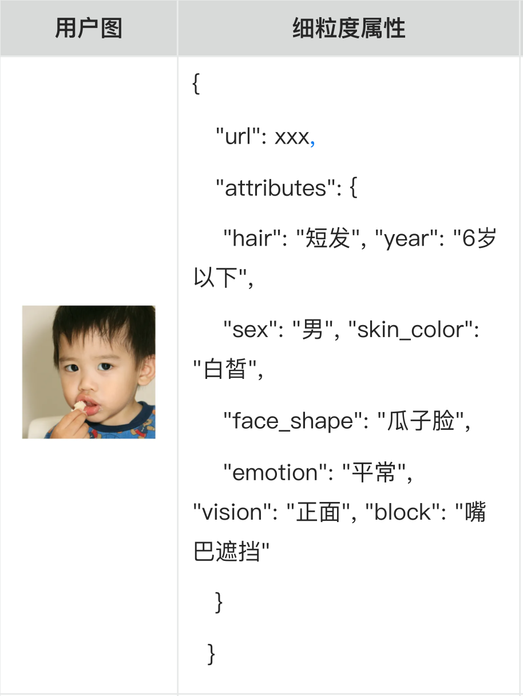
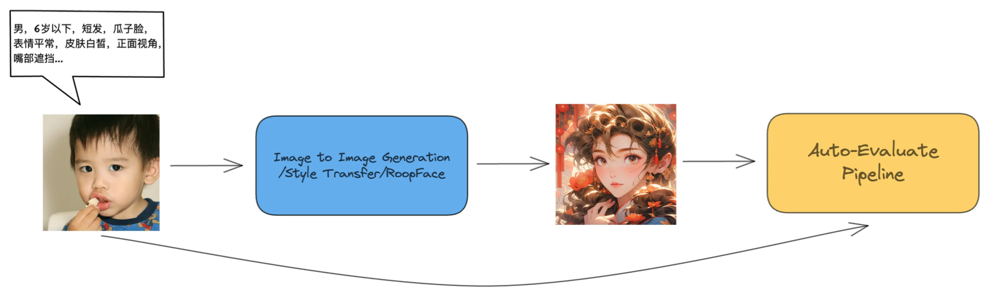

# VQA-GPT
Offer the benchmark and tools to evaluate AI-generated visual concepts including images, audios, 3d and videos.

## Benchmark
### 1. FFHQ-Attr(Face)
This benchmark contains 13061 Asian facical images with 8 attributes: age, gender, hair, facial feature, angle of view, skin color, face block, and facial expression.

#### Why we need this benchmark?
Answer: A fine-grained and targeted benchmark to illustrate the effectiveness of the generative model which can yield stylish individual pictures.

## Acknowledgements
1、Our FFHQ-Attr-benchmark is developed based on the FFHQ-benchmark, thus thanks to https://github.com/NVlabs/ffhq-dataset.git.
